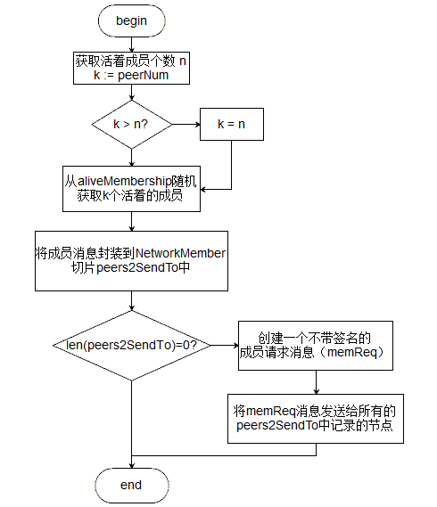
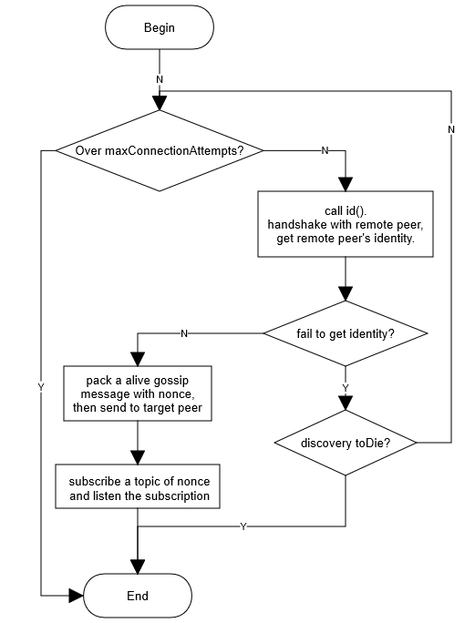
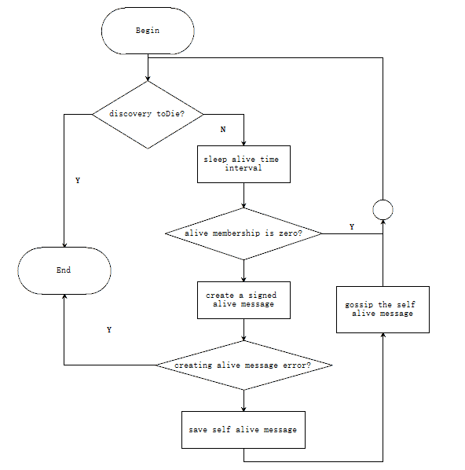
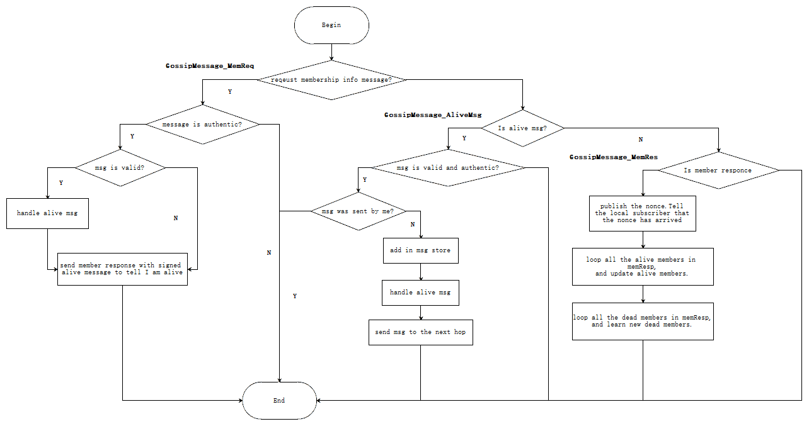
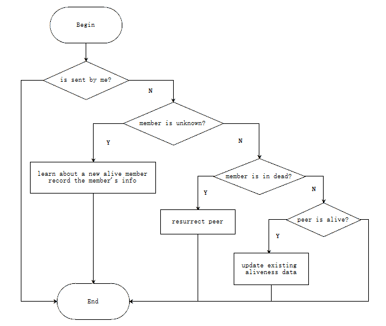

# Gossip-Discovery

## 功能概述

发现层discovery主要作用是定期将心跳包发送给组织中的其他节点以保证自身的生存状态，定期检查组织中其他节点的生存状态，相应更新、维护活的成员列表及失活的成员列表等，同时负责处理来自通信层的三种信息，包括在线信息GossipMessage_AliveMsg，成员请求信息GossipMessage_MemReq和成员回复信息GossipMessage_MemRes。

## Discovery

```
type Discovery interface {
	// 根据PKIID返回对应节点的网络信息，如果没找到，则返回nil
	Lookup(PKIID common.PKIidType) *NetworkMember

	// 返回当前实例的网络信息
	Self() NetworkMember

	// 更新当前实例的元数据
	UpdateMetadata([]byte)

	// 更新当前实例的端点标识
	// Endpoint: 本节点在同一组织内的gossip id，默认为peer的address
	UpdateEndpoint(string)

	// 停止此实例
	Stop()

	// 返回当前实例记录的所有活着成员的网络信息
	GetMembership() []NetworkMember

	// 使用当前实例向给定数量的peers请求其成员信息（ membership information）
	InitiateSync(peerNum int)

	// 连接到远程的节点
	Connect(member NetworkMember, id identifier)
}
```

Discovery 是发现层提供给外部调用的接口。

## 具体实现

### gossipDiscoveryImpl 定义

```
type gossipDiscoveryImpl struct {
	incTime          uint64
	seqNum           uint64
	self             NetworkMember              // 自身的网络信息
	deadLastTS       map[string]*timestamp      // key = pkiID,最近一次记录dead状态的时间戳
	aliveLastTS      map[string]*timestamp      // key = pkiID,最近一次记录alive状态的时间戳
	id2Member        map[string]*NetworkMember  // all known members 所有已知成员, key = pkiID
	aliveMembership  *util.MembershipStore      // 保存活着的成员信息, key = pkiID
	deadMembership   *util.MembershipStore      // 保存死亡的成员信息, key = pkiID
	selfAliveMessage *proto.SignedGossipMessage // 自身活着的信息,用于定期发送给其他节点

	msgStore *aliveMsgStore // 消息存储，存储活着的消息: key = pkiID

	comm  CommService	// 通信层服务接口
	crypt CryptoService // 加解密服务接口
	lock  *sync.RWMutex

	toDieChan        chan struct{}
	toDieFlag        int32            //
	port             int              // 端口
	logger           util.Logger      //
	disclosurePolicy DisclosurePolicy // 公开策略
	pubsub           *util.PubSub     // 发布订阅

	aliveTimeInterval            time.Duration // 活着定期检查时间间隔
	aliveExpirationTimeout       time.Duration // 活着过期超时时间
	aliveExpirationCheckInterval time.Duration // 活着过期检查时间间隔
	reconnectInterval            time.Duration // 重连间隔时间
	msgExpirationFactor          int           // 消息过期系数
	maxConnectionAttempts        int           // 连接尝试最大次数

	bootstrapPeers    []string
	anchorPeerTracker AnchorPeerTracker // 用于检查是否为锚节点
}
```

### 主要接口实现

**Lookup**
```
func (d *gossipDiscoveryImpl) Lookup(PKIID common.PKIidType) *NetworkMember {
	if bytes.Equal(PKIID, d.self.PKIid) {
		return &d.self
	}
	d.lock.RLock()
	defer d.lock.RUnlock()
	return copyNetworkMember(d.id2Member[string(PKIID)])
}
```

若存在PKIid，返回PKIid对应的*NetworkMember（关于NetworkMember具体信息请看后文）；若不存在PKIid，返回nil。


**Self**
```
func (d *gossipDiscoveryImpl) Self() NetworkMember {
	var env *proto.Envelope
	msg, _ := d.aliveMsgAndInternalEndpoint()
	sMsg, err := msg.NoopSign()
	if err != nil {
		d.logger.Warning("Failed creating SignedGossipMessage:", err)
	} else {
		env = sMsg.Envelope
	}
	mem := msg.GetAliveMsg().Membership
	return NetworkMember{
		Endpoint: mem.Endpoint,
		Metadata: mem.Metadata,
		PKIid:    mem.PkiId,
		Envelope: env,
	}
}
```
将自身信息组装成NetworkMember返回。

**UpdateMetadata**
```
func (d *gossipDiscoveryImpl) UpdateMetadata(md []byte) {
	d.lock.Lock()
	defer d.lock.Unlock()
	d.self.Metadata = md
}
```
直接更新自身所带的以元数据。

**UpdateEndpoint**
```
func (d *gossipDiscoveryImpl) UpdateEndpoint(endpoint string) {
	d.lock.Lock()
	defer d.lock.Unlock()
	d.self.Endpoint = endpoint
}
```
直接更新自身的Endpoint信息（节点地址）

**Stop**
```
func (d *gossipDiscoveryImpl) Stop() {
	defer d.logger.Info("Stopped")
	d.logger.Info("Stopping")
	atomic.StoreInt32(&d.toDieFlag, int32(1))
	d.msgStore.Stop()
	d.toDieChan <- struct{}{}
}
```
设置toDieFlag为1(该操作原子安全)，调用msgStore.Stop()停止消息存储相关的go协程，最后往toDieChan传入一个空消息，告知处理发现层事件消息的handleEvents、处理通信层消息的handleMessages退出。  
注意：toDieChan使用了一个巧妙的方式，无论是handleEvents还是handleMessages先接收到toDieChan里面的消息，都会再次往toDieChan写入d.toDieChan <- s，以此来保证后退出的handleEvents或handleMessages也随后退出。

**GetMembership**
```
func (d *gossipDiscoveryImpl) GetMembership() []NetworkMember {
	if d.toDie() {
		return []NetworkMember{}
	}
	d.lock.RLock()
	defer d.lock.RUnlock()

	response := []NetworkMember{}
	for _, m := range d.aliveMembership.ToSlice() {
		member := m.GetAliveMsg()
		response = append(response, NetworkMember{
			PKIid:            member.Membership.PkiId,
			Endpoint:         member.Membership.Endpoint,
			Metadata:         member.Membership.Metadata,
			InternalEndpoint: d.id2Member[string(m.GetAliveMsg().Membership.PkiId)].InternalEndpoint,
			Envelope:         m.Envelope,
		})
	}
	return response
}
```
将aliveMembership里面的成员状态组装成NetworkMember切片返回。

**InitiateSync**
```
func (d *gossipDiscoveryImpl) InitiateSync(peerNum int) {
	if d.toDie() {
		return
	}
	var peers2SendTo []*NetworkMember

	d.lock.RLock()

	n := d.aliveMembership.Size()
	k := peerNum
	if k > n {
		k = n
	}

	aliveMembersAsSlice := d.aliveMembership.ToSlice()
	for _, i := range util.GetRandomIndices(k, n-1) {
		pulledPeer := aliveMembersAsSlice[i].GetAliveMsg().Membership
		var internalEndpoint string
		if aliveMembersAsSlice[i].Envelope.SecretEnvelope != nil {
			internalEndpoint = aliveMembersAsSlice[i].Envelope.SecretEnvelope.InternalEndpoint()
		}
		netMember := &NetworkMember{
			Endpoint:         pulledPeer.Endpoint,
			Metadata:         pulledPeer.Metadata,
			PKIid:            pulledPeer.PkiId,
			InternalEndpoint: internalEndpoint,
		}
		peers2SendTo = append(peers2SendTo, netMember)
	}

	d.lock.RUnlock()

	if len(peers2SendTo) == 0 {
		d.logger.Debugf("No peers to send to, aborting membership sync")
		return
	}

	m, err := d.createMembershipRequest(true)
	if err != nil {
		d.logger.Warningf("Failed creating membership request: %+v", errors.WithStack(err))
		return
	}
	memReq, err := m.NoopSign()
	if err != nil {
		d.logger.Warningf("Failed creating SignedGossipMessage: %+v", errors.WithStack(err))
		return
	}

	for _, netMember := range peers2SendTo {
		d.comm.SendToPeer(netMember, memReq)
	}
}
```
异步初始化，该异步指的是通信层发送数据是异步的，而初始化指的是将自身活着的信息发送给配置文件中配置的其他peer节点，使得节点间开始连接。该函数调用是在discovery的start中首要调用。函数逻辑实现如下图：



注：memReq 是对其它peer的请求消息，目的是告诉对方自身活着的状态。

**Connect**
```
func (d *gossipDiscoveryImpl) Connect(member NetworkMember, id identifier) {
	for _, endpoint := range []string{member.InternalEndpoint, member.Endpoint} {
		if d.isMyOwnEndpoint(endpoint) {
			d.logger.Debug("Skipping connecting to myself")
			return
		}
	}

	d.logger.Debug("Entering", member)
	defer d.logger.Debug("Exiting")
	go func() {
		for i := 0; i < d.maxConnectionAttempts && !d.toDie(); i++ {
			id, err := id()
			if err != nil {
				if d.toDie() {
					return
				}
				d.logger.Warningf("Could not connect to %v : %v", member, err)
				time.Sleep(d.reconnectInterval)
				continue
			}
			peer := &NetworkMember{
				InternalEndpoint: member.InternalEndpoint,
				Endpoint:         member.Endpoint,
				PKIid:            id.ID,
			}
			m, err := d.createMembershipRequest(id.SelfOrg)
			if err != nil {
				d.logger.Warningf("Failed creating membership request: %+v", errors.WithStack(err))
				continue
			}
			req, err := m.NoopSign()
			if err != nil {
				d.logger.Warningf("Failed creating SignedGossipMessage: %+v", errors.WithStack(err))
				continue
			}
			req.Nonce = util.RandomUInt64()
			req, err = req.NoopSign()
			if err != nil {
				d.logger.Warningf("Failed adding NONCE to SignedGossipMessage %+v", errors.WithStack(err))
				continue
			}
			go d.sendUntilAcked(peer, req)
			return
		}

	}()
}
```
连接的过程是异步由协程进行处理的，协程实现逻辑如图：




### 五个关键协程

发现层中以运行又五个关键的协程，分别为：

1. 定期发送心跳包：periodicalSendAlive()
2. 定期检查保存的alive状态节点是否过期：periodicalCheckAlive()
3. 消息处理：handleMessages()
4. 定期重连dead状态的节点：periodicalReconnectToDead()
5. 事件处理：handleEvents()

以上五个协程的触发均在NewDicoveryService时开始：

```
func NewDiscoveryService(self NetworkMember, comm CommService, crypt CryptoService, disPol DisclosurePolicy,
	config DiscoveryConfig, anchorPeerTracker AnchorPeerTracker, logger util.Logger) Discovery {
	d := &gossipDiscoveryImpl{
		... // 省略初始化
	}

	d.validateSelfConfig()
	d.msgStore = newAliveMsgStore(d)

    // 五个关键协程的启动 
	go d.periodicalSendAlive()
	go d.periodicalCheckAlive()
	go d.handleMessages()
	go d.periodicalReconnectToDead()
	go d.handleEvents()

	return d
}
```

### periodicalSendAlive

```
func (d *gossipDiscoveryImpl) periodicalSendAlive() {
	defer d.logger.Debug("Stopped")

	for !d.toDie() {
		d.logger.Debug("Sleeping", d.aliveTimeInterval)
		time.Sleep(d.aliveTimeInterval)
		if d.aliveMembership.Size() == 0 {
			d.logger.Debugf("Empty membership, no one to send a heartbeat to")
			continue
		}
		msg, err := d.createSignedAliveMessage(true)
		if err != nil {
			d.logger.Warningf("Failed creating alive message: %+v", errors.WithStack(err))
			return
		}
		d.lock.Lock()
		d.selfAliveMessage = msg
		d.lock.Unlock()
		d.comm.Gossip(msg)
	}
}
```

periodicalSendAlive 为定期发送心跳包向其他peer节点证明自身活着的协程。

若discovery停止，则直接退出；否则在有已连接节点的情况下发送心跳包。具体实现逻辑如下图：



### periodicalCheckAlive

```
func (d *gossipDiscoveryImpl) periodicalCheckAlive() {
	defer d.logger.Debug("Stopped")

	for !d.toDie() {
		time.Sleep(d.aliveExpirationCheckInterval)
		dead := d.getDeadMembers()
		if len(dead) > 0 {
			d.logger.Debugf("Got %v dead members: %v", len(dead), dead)
			d.expireDeadMembers(dead)
		}
	}
}

func (d *gossipDiscoveryImpl) expireDeadMembers(dead []common.PKIidType) {
	d.logger.Warning("Entering", dead)
	defer d.logger.Warning("Exiting")

	var deadMembers2Expire []*NetworkMember

	d.lock.Lock()

	for _, pkiID := range dead {
		if _, isAlive := d.aliveLastTS[string(pkiID)]; !isAlive {
			continue
		}
		deadMembers2Expire = append(deadMembers2Expire, d.id2Member[string(pkiID)])
		// move lastTS from alive to dead
		lastTS, hasLastTS := d.aliveLastTS[string(pkiID)]
		if hasLastTS {
			d.deadLastTS[string(pkiID)] = lastTS
			delete(d.aliveLastTS, string(pkiID))
		}

		if am := d.aliveMembership.MsgByID(pkiID); am != nil {
			d.deadMembership.Put(pkiID, am)
			d.aliveMembership.Remove(pkiID)
		}
	}

	d.lock.Unlock()

	for _, member2Expire := range deadMembers2Expire {
		d.logger.Warning("Closing connection to", member2Expire)
		d.comm.CloseConn(member2Expire)
	}
}
```

periodicalCheckAlive 检查成员最后一次活跃的时间与当前时间差，是否大于最大过期时间。若有过期的节点，将过期的节点选出后，将其从保存alive状态的节点map集合(aliveLastTS与aliveMmbership)中剔除，并将其添加到dead状态的map集合中(deadMembership)。最后是关闭对过期节点的连接(comm.CloseConn)。

### handleMessages

```
func (d *gossipDiscoveryImpl) handleMessages() {
	defer d.logger.Debug("Stopped")

	in := d.comm.Accept()
	for !d.toDie() {
		select {
		case s := <-d.toDieChan:
			d.toDieChan <- s
			return
		case m := <-in:
			d.handleMsgFromComm(m)
		}
	}
}
```

handleMessages 处理自通信层comm到来的消息。若有消息到来，则交由handleMsgFromComm处理。

**handleMsgFromComm**

```
func (d *gossipDiscoveryImpl) handleMsgFromComm(msg proto.ReceivedMessage) {
	if msg == nil {
		return
	}
	m := msg.GetGossipMessage()
	if m.GetAliveMsg() == nil && m.GetMemRes() == nil && m.GetMemReq() == nil {
		d.logger.Warning("Got message with wrong type (expected Alive or MembershipResponse or MembershipRequest message):", m.GossipMessage)
		return
	}

	d.logger.Debug("Got message:", m)
	defer d.logger.Debug("Exiting")

	// 获取成员信息请求
	if memReq := m.GetMemReq(); memReq != nil {
		selfInfoGossipMsg, err := memReq.SelfInformation.ToGossipMessage()
		if err != nil {
			d.logger.Warningf("Failed deserializing GossipMessage from envelope: %+v", errors.WithStack(err))
			return
		}

		if !d.crypt.ValidateAliveMsg(selfInfoGossipMsg) {
			return
		}

		if d.msgStore.CheckValid(selfInfoGossipMsg) {
			d.handleAliveMessage(selfInfoGossipMsg)
		}

		var internalEndpoint string
		if memReq.SelfInformation.SecretEnvelope != nil {
			internalEndpoint = memReq.SelfInformation.SecretEnvelope.InternalEndpoint()
		}

		// Sending a membership response to a peer may block this routine
		// in case the sending is deliberately slow (i.e attack).
		// will keep this async until I'll write a timeout detector in the comm layer
		go d.sendMemResponse(selfInfoGossipMsg.GetAliveMsg().Membership, internalEndpoint, m.Nonce)
		return
	}

	if m.IsAliveMsg() {
		if !d.msgStore.CheckValid(m) || !d.crypt.ValidateAliveMsg(m) {
			return
		}
		// If the message was sent by me, ignore it and don't forward it further
		if d.isSentByMe(m) {
			return
		}

		d.msgStore.Add(m)
		d.handleAliveMessage(m)
		d.comm.Forward(msg)
		return
	}

	if memResp := m.GetMemRes(); memResp != nil {
		d.pubsub.Publish(fmt.Sprintf("%d", m.Nonce), m.Nonce)
		for _, env := range memResp.Alive {
			am, err := env.ToGossipMessage()
			if err != nil {
				d.logger.Warningf("Membership response contains an invalid message from an online peer:%+v", errors.WithStack(err))
				return
			}
			if !am.IsAliveMsg() {
				d.logger.Warning("Expected alive message, got", am, "instead")
				return
			}

			if d.msgStore.CheckValid(am) && d.crypt.ValidateAliveMsg(am) {
				d.handleAliveMessage(am)
			}
		}

		for _, env := range memResp.Dead {
			dm, err := env.ToGossipMessage()
			if err != nil {
				d.logger.Warningf("Membership response contains an invalid message from an offline peer %+v", errors.WithStack(err))
				return
			}

			// Newer alive message exists or the message isn't authentic
			if !d.msgStore.CheckValid(dm) || !d.crypt.ValidateAliveMsg(dm) {
				continue
			}

			newDeadMembers := []*proto.SignedGossipMessage{}
			d.lock.RLock()
			if _, known := d.id2Member[string(dm.GetAliveMsg().Membership.PkiId)]; !known {
				newDeadMembers = append(newDeadMembers, dm)
			}
			d.lock.RUnlock()
			d.learnNewMembers([]*proto.SignedGossipMessage{}, newDeadMembers)
		}
	}
}
```

handleMsgFromComm具体实现逻辑如下：



在handleMsgFromComm中主要处理三种消息，分别是来自其他peer请求成员信息的消息GossipMessage_MemReq、来自其他peer验证自身存活状态的消息GossipMessage_AliveMsg、自身发送的成员请求消息后收到的回复消息GossipMessage_MemRes。

当收到GossipMessage_MemReq消息：若是新成员，则将该成员相关信息存储起来，然后回复一个自身的alive message；然后将自身保存的所有alive节点信息、dead节点信息封装到数据包中，返回给目标节点(target member)。

当收到GossipMessage_AliveMsg消息：若是我自己发送的alive message，则不用处理直接返回；若不是，则将其成员信息进行保存，然后回复一个alive message，之后再将该成员发送过来的alive message随机转发给自身保存的（若有）一个alive的成员（下一跳）。

当收到GossipMessage_MemRes消息：对收到的数据包中的所有alive节点信息，进行校验后回复一个alive message，确保对方也知道自己的存活状态；对收到的所有dead节点信息，将其添加到保存dead信息的deadMembership集合中。

其中**handleAliveMessage**实现如下：

```
func (d *gossipDiscoveryImpl) handleAliveMessage(m *proto.SignedGossipMessage) {
	d.logger.Debug("Entering", m)
	defer d.logger.Debug("Exiting")

	if d.isSentByMe(m) {
		return
	}

	pkiID := m.GetAliveMsg().Membership.PkiId

	ts := m.GetAliveMsg().Timestamp

	d.lock.RLock()
	_, known := d.id2Member[string(pkiID)]
	d.lock.RUnlock()

	if !known {
		d.learnNewMembers([]*proto.SignedGossipMessage{m}, []*proto.SignedGossipMessage{})
		return
	}

	d.lock.RLock()
	_, isAlive := d.aliveLastTS[string(pkiID)]
	lastDeadTS, isDead := d.deadLastTS[string(pkiID)]
	d.lock.RUnlock()

	if !isAlive && !isDead {
		d.logger.Panicf("Member %s is known but not found neither in alive nor in dead lastTS maps, isAlive=%v, isDead=%v", m.GetAliveMsg().Membership.Endpoint, isAlive, isDead)
		return
	}

	if isAlive && isDead {
		d.logger.Panicf("Member %s is both alive and dead at the same time", m.GetAliveMsg().Membership)
		return
	}

	if isDead {
		if before(lastDeadTS, ts) {
			// resurrect peer
			d.resurrectMember(m, *ts)
		} else if !same(lastDeadTS, ts) {
			d.logger.Debug(m.GetAliveMsg().Membership, "lastDeadTS:", lastDeadTS, "but got ts:", ts)
		}
		return
	}

	d.lock.RLock()
	lastAliveTS, isAlive := d.aliveLastTS[string(pkiID)]
	d.lock.RUnlock()

	if isAlive {
		if before(lastAliveTS, ts) {
			d.learnExistingMembers([]*proto.SignedGossipMessage{m})
		} else if !same(lastAliveTS, ts) {
			d.logger.Debug(m.GetAliveMsg().Membership, "lastAliveTS:", lastAliveTS, "but got ts:", ts)
		}

	}
	// else, ignore the message because it is too old
}
```

handleAliveMessage 逻辑图：



### periodicalReconnectToDead

```
func (d *gossipDiscoveryImpl) periodicalReconnectToDead() {
	defer d.logger.Debug("Stopped")

	for !d.toDie() {
		wg := &sync.WaitGroup{}

		for _, member := range d.copyLastSeen(d.deadLastTS) {
			wg.Add(1)
			go func(member NetworkMember) {
				defer wg.Done()
				if d.comm.Ping(&member) {
					d.logger.Debug(member, "is responding, sending membership request")
					d.sendMembershipRequest(&member, true)
				} else {
					d.logger.Debug(member, "is still dead")
				}
			}(member)
		}

		wg.Wait()
		d.logger.Debug("Sleeping", d.reconnectInterval)
		time.Sleep(d.reconnectInterval)
	}
}
```

periodicalReconnectToDead 首先对deadLastTS拷贝一份镜像，然后都其中的成员进行Ping操作，检测对方的存活状态，若接收到对方的Ping回包，则再向该成员发送成员请求消息（membership request），请求对方的成员信息。

### handleEvents

```
func (d *gossipDiscoveryImpl) handleEvents() {
	defer d.logger.Debug("Stopped")

	for !d.toDie() {
		select {
		case deadPeer := <-d.comm.PresumedDead():
			if d.isAlive(deadPeer) {
				d.expireDeadMembers([]common.PKIidType{deadPeer})
			}
		case changedPKIID := <-d.comm.IdentitySwitch():
			// If a peer changed its PKI-ID, purge the old PKI-ID
			d.purge(changedPKIID)
		case s := <-d.toDieChan:
			d.toDieChan <- s
			return
		}
	}
}
```

handleEvents 监测的事件有三个：节点假定死亡事件PresumedDead、身份标识改变事件IdentitySwitch、发现层退出事件toDieChan。

相关事件处理流程：
- 节点假定死亡事件：首先从通信层返回假定处于死亡状态的节点，发现层再次进行检测该节点是否处于活着的状态，若处于活着的状态，则不做处理；否则将该节点设置为过期，从保存活着状态的集合中删除，并添加到保存死亡状态的集合中。
- 身份标识改变事件：从通信层接收到节点标识PKIid改变的事件后，直接将所有集合中保存有原来的PKIid的条目进行清除。因为PKIid改变即视作该节点已经消亡。
- 发现层退出事件：收到toDieChan事件，则再次将消息放入toDieChan，确保其他检测toDieChan事件的协程退出，随后自身退出handleEvents事件检测。

### 关联的数据结构

**NetworkMember**

```
type NetworkMember struct {
	Endpoint         string            // 即ExternalEndpoint，节点被组织外节点感知时的地址，默认为空，代表不被其他组织所感知。
	Metadata         []byte            // 元数据
	PKIid            common.PKIidType  // PKIid
	InternalEndpoint string            // 组织内的Endpoint标识。即gossip id，默认为peer.address
	Properties       *proto.Properties // 属性：账本高度、是否离开通道、链码集
	*proto.Envelope                    // 信封：Gossip消息、信息的签名、加密的消息(SecretEnvelope)
}
```

NetworkMember 代表一个peer节点在gossip网络中的标识。

其中**Properties**与**Envelope**结构如下：

```
type Properties struct {
	LedgerHeight         uint64       `protobuf:"varint,1,opt,name=ledger_height,json=ledgerHeight,proto3" json:"ledger_height,omitempty"`
	LeftChannel          bool         `protobuf:"varint,2,opt,name=left_channel,json=leftChannel,proto3" json:"left_channel,omitempty"`
	Chaincodes           []*Chaincode `protobuf:"bytes,3,rep,name=chaincodes,proto3" json:"chaincodes,omitempty"`
	XXX_NoUnkeyedLiteral struct{}     `json:"-"`
	XXX_unrecognized     []byte       `json:"-"`
	XXX_sizecache        int32        `json:"-"`
}
```

```
type Envelope struct {
	Payload              []byte          `protobuf:"bytes,1,opt,name=payload,proto3" json:"payload,omitempty"`
	Signature            []byte          `protobuf:"bytes,2,opt,name=signature,proto3" json:"signature,omitempty"`
	SecretEnvelope       *SecretEnvelope `protobuf:"bytes,3,opt,name=secret_envelope,json=secretEnvelope,proto3" json:"secret_envelope,omitempty"`
	XXX_NoUnkeyedLiteral struct{}        `json:"-"`
	XXX_unrecognized     []byte          `json:"-"`
	XXX_sizecache        int32           `json:"-"`
}
```

## 总结

发现层首先实现了对成员信息的记录，其中包括成员死亡状态记录、活着状态记录、最近记录活着状态的时间戳以及最近记录死亡状态时的时间戳等；其次是对成员状态的维护，维护包括对保存的节点进行定期检查、定期清理、定期重连等，确保记录的节点信息的有效性；最后是获取其他节点的成员信息，使得自身能够通过连接的一个节点发现更多的其他节点，以及能够使得自身被更多的节点发现。
