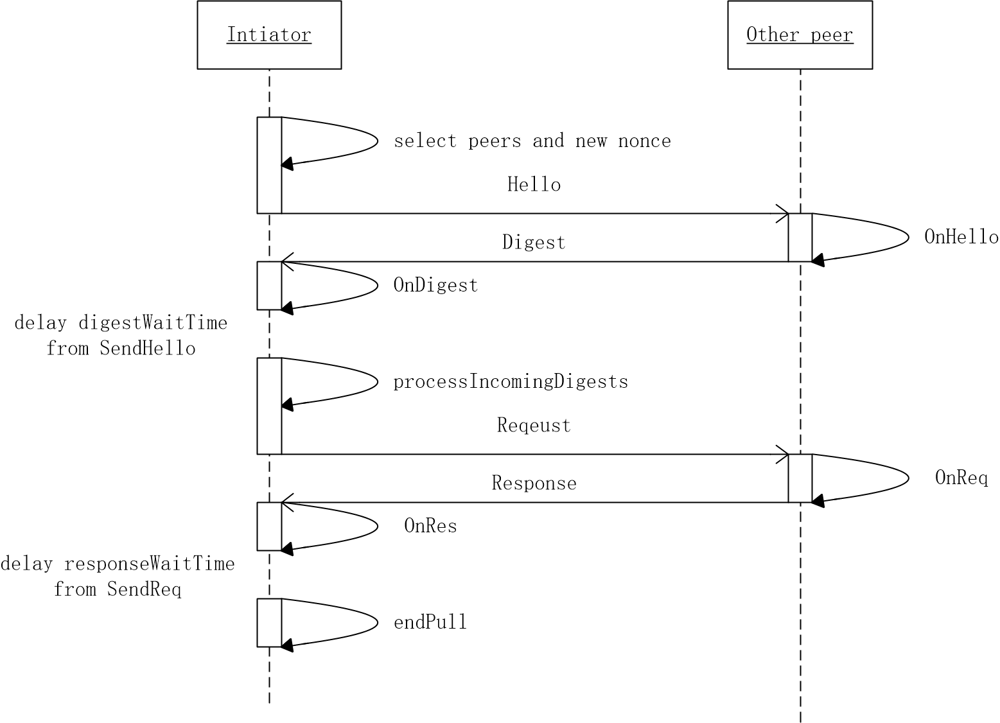

# Gossip-PullEngine

PullEngine 主要用来同步block以及节点之间的证书。

开始之前先看下官方的说明：

```
   PullEngine is an object that performs pull-based gossip, and maintains an internal state of items
   identified by string numbers.
   The protocol is as follows:
   1) The Initiator sends a Hello message with a specific NONCE to a set of remote peers.
   2) Each remote peer responds with a digest of its messages and returns that NONCE.
   3) The initiator checks the validity of the NONCEs received, aggregates the digests,
      and crafts a request containing specific item ids it wants to receive from each remote peer and then
      sends each request to its corresponding peer.
   4) Each peer sends back the response containing the items requested, if it still holds them and the NONCE.

    Other peer				   			                Initiator
	 O	<-------- Hello <NONCE> -------------------------	O
	/|\	--------- Digest <[3,5,8, 10...], NONCE> --------> /|\
	 |	<-------- Request <[3,8], NONCE> -----------------  |
	/ \	--------- Response <[item3, item8], NONCE>-------> / \
```

PullEngine 的工作流程如下：

1. Initiator 发送一个带有特定 NONCE 的 Hello 消息给一组远端的peer节点。（注：每个peer收到的 Hello 消息带有的 NONCE 值均不同，这里的 NONCE 就是用于标识一个peer）
2. peer 节点收到 Hello 消息后，返回自身持有的相关内容的摘要信息 [3, 5, 8, 10...], 以及第一步中的 NONCE 值。
3. Initiator 收到摘要后，首先检查NONCE的有效性，其次将自身已有的摘要与收到的摘要进行对比，判断出自身缺失的摘要 [3, 8]后，将缺失的摘要与 NONCE 封装成 Reqeust并向指定的节点请求。（注：缺失的摘要往往是需要从多个节点进行获取）
4. peer 节点收到其他节点缺失摘要的 Request 后，将摘要对应的内容[item3, item8] 与 NONCE 返回给请求的节点。

Initiator 通过以上四步即可将自身缺失的内容进行补齐。而 PullEngine 指的就是在内容缺失的情况下，是依靠自身请求而获得的，这是一个主动拉取指定内容的过程。

## 主要组成部分

由于拉取引擎与上层并不是直接交互的交互，而是由三个主要部分组成：拉取引擎的具体实现PullEngine，协助PullEngine发送消息的适配器PullAdaptor，协助PullEngine与上层业务交互的中介者Mediator。本文主要讲解PullEngine的实现，而关于实现PullAdapter与Mediator接口的pullMediatorImpl将会在接下来的文章讲解。下面概要介绍下三个部分内容：

### PullEngine

```
type PullEngine struct {
	PullAdapter                    // pull 适配器
	stopFlag           int32               // 停止标志
	state              *util.Set           // 线程安全的map集合
	item2owners        map[string][]string // <item, owners>
	peers2nonces       map[string]uint64   // <endpoint, nonce> endpoint: 端点地址
	nonces2peers       map[uint64]string   // <nonce, endpoint>
	acceptingDigests   int32               // 正在接收摘要
	acceptingResponses int32               // 正在接收回复
	lock               sync.Mutex
	outgoingNONCES     *util.Set
	incomingNONCES     *util.Set
	digFilter          DigestFilter	// 摘要过滤器

	digestWaitTime   time.Duration
	requestWaitTime  time.Duration
	responseWaitTime time.Duration
}
```

PullEngine 是在 PullAdapter 的帮助下实际调用 pull 算法的组件。

其中比较重要的是3个map结构：
* item2owners：保存了拥有摘要item所对应的节点。
* peers2nonces：保存了节点地址所对应的NONCE值。
* nonces2peers：保存了NONCE值所对应的节点地址。

### PullAdapter

```
type PullAdapter interface {
	// SelectPeers 返回peer节点的切片，PullEngine将使用它来初始化协议
	SelectPeers() []string

	// Hello 发送一个Hello消息来初始化协议，并返回一个被期望在摘要
	// 信息中返回的 NONCE 值
	Hello(dest string, nonce uint64)

	// SendDigest 发送一个摘要给远端PullEngine。
	// context 参数指定要发送到的远端引擎。
	SendDigest(digest []string, nonce uint64, context interface{})

	// SendReq 发送 items 到一个由 dest 指定地址的远端 PullEngine
	SendReq(dest string, items []string, nonce uint64)

	// SendRes 发送 items 到一个由 context 指定地址的远端 PullEngine
	SendRes(items []string, context interface{}, nonce uint64)
}
```

PullAdapter 扮演的角色是协助 PullEngine 发送消息，使 PullEngine 的任务处理单一，并可以不局限于数据发送的问题。      

具体使用过程为：本地 PullEngine 使用 PullAdapter 向远程 PullEngine 发送消息。从远程 PullEngine 发出的消息到达时，使用 PullEngine 提供的 OnHello、OnDigest、OnReq以及OnRes函数处理消息。

PullAdapter 是由 pullMediatorImpl 实现，这里稍后会展开说明。

### Mediator

```
type Mediator interface {
	// 停止运行 Mediator
	Stop()

	// 为特定类型的pull消息注册一个消息钩子
	RegisterMsgHook(MsgType, MessageHook)

	// 添加一个 GossipMessage 到 Mediator
	Add(*protoext.SignedGossipMessage)

    // 从 Mediator 中移除一个带有匹配摘要的 GossipMessage
	Remove(digest string)

	// 处理来自某个远程peer节点的消息
	HandleMessage(msg protoext.ReceivedMessage)
}
```

## PullEngine 实现

### OnHello

```
func (engine *PullEngine) OnHello(nonce uint64, context interface{}) {
	// 1、将 nonce 记录到 incomingNONCES
	engine.incomingNONCES.Add(nonce)

	// 2、若是在 requestWaitTime 时间内没有收到 request，则移除 nonce
	time.AfterFunc(engine.requestWaitTime, func() {
		engine.incomingNONCES.Remove(nonce)
	})

	// 3、获取所有保存在集合中的消息摘要
	a := engine.state.ToArray()

	// 4、由filter筛选出所有符合要求的摘要(digest)
	var digest []string
	filter := engine.digFilter(context)
	for _, item := range a {
		dig := item.(string)
		if !filter(dig) {
			continue
		}
		digest = append(digest, dig)
	}

	// 5、交由PullAdapter发送摘要信息
	if len(digest) == 0 {
		return
	}
	engine.SendDigest(digest, nonce, context)
}
```

OnHello 处理从远程节点发送来的 Hello 消息。其处理的过程就是从自身所有摘要信息中筛选出对方感兴趣的摘要信息，然后发送给对方。

### OnDigest

```
func (engine *PullEngine) OnDigest(digest []string, nonce uint64, context interface{}) {
	// 1、若正在接收摘要或不存在该nonce，则直接返回
	if !engine.isAcceptingDigests() || !engine.outgoingNONCES.Exists(nonce) {
		return
	}

	engine.lock.Lock()
	defer engine.lock.Unlock()

	// 2、由获取到的摘要信息，筛选出自身缺失的摘要后将nonce保存，便于后续请求缺失的摘要。
	for _, n := range digest {
		if engine.state.Exists(n) { // 是否已存在该摘要
			continue
		}

		if _, exists := engine.item2owners[n]; !exists {
			engine.item2owners[n] = make([]string, 0) // 初始化
		}

		// 将拥有该摘要的节点所对应的nonce值保存
		engine.item2owners[n] = append(engine.item2owners[n], engine.nonces2peers[nonce])
	}
}
```

OnDigest 处理从远程节点发送来的 Digest 信息。从实现中不难看出，OnDigest 仅仅是将自身缺失摘要的拥有者保存下来。

### OnReq

```
func (engine *PullEngine) OnReq(items []string, nonce uint64, context interface{}) {
	if !engine.incomingNONCES.Exists(nonce) { // 是否保存交互的nonce值
		return
	}
	engine.lock.Lock()
	defer engine.lock.Unlock()

	// 1、筛选远程节点请求的元素(即消息摘要)，并将元素加入待发送序列(items2Send)中
	filter := engine.digFilter(context)
	var items2Send []string
	for _, item := range items {
		if engine.state.Exists(item) && filter(item) {
			items2Send = append(items2Send, item)
		}
	}

	if len(items2Send) == 0 {
		return
	}

	// 2、异步发送响应消息
	go engine.SendRes(items2Send, context, nonce)
}
```

OnReq 处理从远程节点发送来的 request 消息。处理的过程仅仅是筛选出自身存在的远程节点感兴趣的摘要，封装到一个切片中，然后异步发送一个响应消息。

响应仅仅是回复摘要吗？不！SendRes会通过摘要整理出摘要所对应的消息，然后封装成Gossip消息发送。

### OnRes

```
func (engine *PullEngine) OnRes(items []string, nonce uint64) {
	if !engine.outgoingNONCES.Exists(nonce) || !engine.isAcceptingResponses() {
		return
	}

	engine.Add(items...)
}
```

OnRes 处理从远程节点发来的 response 消息。此处仅仅是将收到的摘要信息保存到state集合中。

在 OnReq 咱说返回的是摘要所对应的消息吗，为什么 OnRes 处理的依旧仅仅是消息摘要？因为对消息的处理已由pullMediatorImpl完成，拉取引擎PullEngine仅仅保存已经存在的消息的摘要，因为PullEngine只要能够判断缺失哪些摘要即可。

### pull 流程

现在我们已经了解了OnHello、OnDigest、OnReq、OnRes实现的功能以及具体实际逻辑，但是第一步的Hello消息发送是在哪里开始的呢？接下来咱们就来串一下这整个拉取流程。

```
func NewPullEngineWithFilter(participant PullAdapter, sleepTime time.Duration, df DigestFilter,
	config PullEngineConfig) *PullEngine {
	engine := &PullEngine{
		... // 初始化相关成员变量
	}

	go func() {
		for !engine.toDie() {
			time.Sleep(sleepTime)
			if engine.toDie() {
				return
			}
			engine.initiatePull()
		}
	}()

	return engine
}
```

首先是初始化操作，具体初始化参数咱们就不讨论，主要将关注点放到无限循环的协程实现，这里每间隔sleepTime就调用一次initiatePull。似乎initiatePull就是实现关键？

```
func (engine *PullEngine) initiatePull() {
	engine.lock.Lock()
	defer engine.lock.Unlock()

	// 1、发送Hello消息
	engine.acceptDigests()
	for _, peer := range engine.SelectPeers() {
		nonce := engine.newNONCE()        // 获取一个唯一的nonce值
		engine.outgoingNONCES.Add(nonce)  // 保存发送的nonce
		engine.nonces2peers[nonce] = peer // 记录nonce所对应的peer（注：这里的peer指的是节点对应的地址）
		engine.peers2nonces[peer] = nonce // 记录peer所对应的nonce
		engine.Hello(peer, nonce)         // 向peer发送Hello消息
	}

	// 2、在 digestWaitTime 时间后开始调用processIncomingDigests，对到来Digest进行处理
	time.AfterFunc(engine.digestWaitTime, func() {
		engine.processIncomingDigests()
	})
}
```

initiatePull 果然是拉取的关键，其发起了 Hello 请求。

- 为什么要等待 digestWaitTime 再调用 processIncomingDigests？a.自身发起Hello请求，远程节点收到Hello后调用OnHello处理后发送Digest消息，自身收到Digest后调用OnDigest处理，但是根据上文知道OnDigest仅仅是将相关摘要和远程节点的nonce值进行保存，而没有进行接下来的处理。b.且消息的来回（即收到远程节点的Digest）是需要时间的。c.待会我们还会发现，processIncomingDigests进行了加锁与停止接收Digest操作，若直接调用将会导致不会接收到Digest的情形。故需要等待digestWaitTime再调用processIncomingDigests处理。

```
func (engine *PullEngine) processIncomingDigests() {
	engine.ignoreDigests() // 忽略接下来收到的 Digest

	engine.lock.Lock() // lock
	defer engine.lock.Unlock()

	// 1、组装待发送的 request 的内容
	requestMapping := make(map[string][]string)
	for n, sources := range engine.item2owners {
		// 随机选择一个源(摘要拥有者)
		source := sources[util.RandomInt(len(sources))]
		if _, exists := requestMapping[source]; !exists {
			requestMapping[source] = make([]string, 0)
		}
		// append the number to that source
		requestMapping[source] = append(requestMapping[source], n)
	}

	// 2、允许OnRes处理 Response 消息
	engine.acceptResponses()

	// 3、发送 Request 消息
	for dest, seqsToReq := range requestMapping {
		engine.SendReq(dest, seqsToReq, engine.peers2nonces[dest])
	}

	// 4、在responseWaitTime时间后调用endPull
	time.AfterFunc(engine.responseWaitTime, engine.endPull)
}
```

processIncomingDigests 中主要将item2owners（由OnDigest处理得到）的信息封装成Request请求发送给指定节点，然后再等待 Response 消息的返回。在responseWaitTime时间后进行调用endPull。

```
func (engine *PullEngine) endPull() {
	engine.lock.Lock()
	defer engine.lock.Unlock()

	atomic.StoreInt32(&(engine.acceptingResponses), int32(0))
	engine.outgoingNONCES.Clear()

	engine.item2owners = make(map[string][]string)
	engine.peers2nonces = make(map[string]uint64)
	engine.nonces2peers = make(map[uint64]string)
}
```

endPull 做了相关的清空操作。

**至此，一次pull过程结束！！！**

## 总结

- 对消息的补全操作，是由先判断缺失哪些消息的摘要，然后请求缺失的摘要信息完成的。
- PullEngine 没有保存具体的消息，而仅仅保存消息的摘要。
- PullEngine 中能够处理Hello、Digest、Request及Response消息，但是消息发送由 PullAdapter 完成。
- 整个拉取流程是在协程中一直无限循环的，由 initiatePull 开始整个拉取流程。
- 无论是Digest还是Response的消息处理函数都是延时调用的。

**pull流程**

